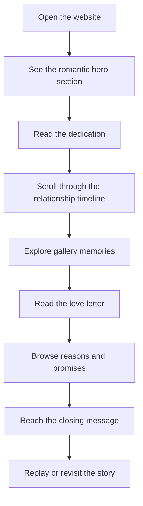

## 1. Product Overview
Ryah is a romantic, highly polished single-page website created as a personal gift for the user's girlfriend.
- The site is designed to feel intimate, memorable, and emotionally warm through storytelling, motion, music-friendly atmosphere, and meaningful content blocks.
- Its value is emotional rather than commercial: it becomes a digital keepsake that celebrates the relationship in a beautiful, lasting format.

## 2. Core Features

### 2.1 Feature Module
1. **Landing page**: cinematic hero, short dedication, entrance animation, primary call to scroll through the story
2. **Our story section**: relationship timeline with milestone cards and emotional captions
3. **Memory gallery section**: curated photo or visual memory cards with hover reveals and short notes
4. **Love letter section**: a longer heartfelt message presented in an elegant reading layout
5. **Reasons I Love You section**: animated card list or statement grid with playful, affectionate micro-interactions
6. **Closing section**: final promise, signature-style ending, and optional replay interaction for the page experience

### 2.2 Page Details
| Page Name | Module Name | Feature description |
|-----------|-------------|---------------------|
| Landing page | Hero scene | Full-screen romantic introduction with layered typography, soft ambient background effects, and a smooth entrance sequence |
| Landing page | Dedication block | Short personal message with graceful reveal animation and clear invitation to continue scrolling |
| Landing page | Story timeline | Visual sequence of relationship milestones with alternating layout, dates, titles, and short memory snippets |
| Landing page | Memory gallery | Image or illustrated memory cards with hover states, captions, and subtle depth effects |
| Landing page | Love letter | Long-form message area optimized for emotional readability with refined spacing and typography |
| Landing page | Reasons list | Interactive set of reasons, promises, or favorite things with staggered reveal motion |
| Landing page | Closing moment | Final emotional section with signature, ending line, and replay or return-to-top interaction |

## 3. Core Process
The visitor lands on a dramatic introduction, reads a personal dedication, scrolls through a relationship story, explores shared memories, reads a heartfelt letter, and reaches a closing section that leaves a strong emotional final impression.

## 4. User Interface Design
### 4.1 Design Style
- Primary colors: deep plum, soft blush, warm ivory, candle-gold accents
- Button style: soft rounded buttons with luminous hover glow and gentle depth
- Fonts and sizes: elegant editorial display font paired with a refined serif or humanist body font; large romantic headlines, comfortable letter-reading body copy
- Layout style: desktop-first cinematic storytelling with layered sections, alternating compositions, soft overlap, and immersive scrolling
- Icon style suggestions: minimal line icons, star/sparkle accents used sparingly, handwritten-signature details where appropriate

### 4.2 Page Design Overview
| Page Name | Module Name | UI Elements |
|-----------|-------------|-------------|
| Landing page | Hero scene | Oversized headline, ambient glow, layered gradients, decorative frame details, slow entrance motion |
| Landing page | Dedication block | Centered message card, soft light textures, subtle fade-and-rise animation |
| Landing page | Story timeline | Alternating milestone cards, connector line, date labels, soft hover elevation |
| Landing page | Memory gallery | Editorial collage grid, rounded image panels, caption overlays, gentle zoom interaction |
| Landing page | Love letter | Paper-like reading panel, elegant margins, signature accent, soft vignette background |
| Landing page | Reasons list | Animated cards or pill blocks with staggered reveal, hover shimmer, warm accent tones |
| Landing page | Closing moment | Large final statement, signature treatment, luminous button, return-to-top motion |

### 4.3 Responsiveness
The website will be designed desktop-first, then adapted for tablet and mobile with stacked layouts, simplified decorative layering, touch-friendly spacing, and preserved emotional impact across smaller screens.
