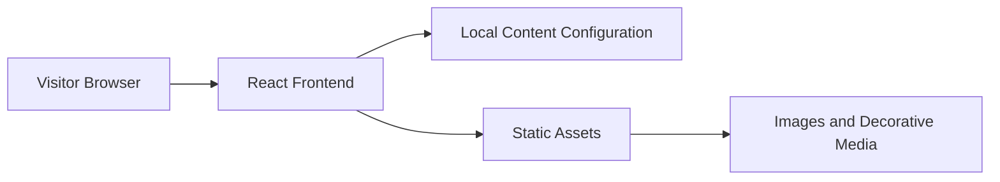

## 1. Architecture Design


## 2. Technology Description
- Frontend: React 18 + Tailwind CSS 3 + Vite
- Initialization Tool: Vite
- Backend: None
- Database: None
- Content Strategy: Static local content stored in structured frontend data objects for easy personalization
- Motion Strategy: CSS transitions and selective Framer Motion usage for page-load reveals, scroll choreography, and hover refinement

## 3. Route Definitions
| Route | Purpose |
|-------|---------|
| / | Single-page romantic experience containing all sections of the website |

## 4. Component Definitions
| Component | Purpose |
|-----------|---------|
| `HeroSection` | Presents the cinematic first impression, heading, dedication teaser, and primary scroll cue |
| `TimelineSection` | Renders relationship milestones with alternating cards and responsive storytelling layout |
| `GallerySection` | Displays memory cards or photos with captions and hover interactions |
| `LetterSection` | Shows the main long-form romantic message in an elegant reading format |
| `ReasonsSection` | Highlights affectionate reasons, promises, or favorite details in animated blocks |
| `ClosingSection` | Delivers the final message, signature, and replay or return-to-top interaction |
| `AmbientBackground` | Provides decorative gradients, glow effects, and lightweight atmospheric visuals across the page |

## 5. Data Structure
```ts
type TimelineItem = {
  date: string;
  title: string;
  description: string;
};

type MemoryCard = {
  title: string;
  caption: string;
  image: string;
};

type RomanticContent = {
  recipientName: string;
  heroHeadline: string;
  dedication: string;
  timeline: TimelineItem[];
  gallery: MemoryCard[];
  loveLetter: string[];
  reasons: string[];
  closingMessage: string;
  signature: string;
};
```

## 6. Implementation Notes
- Use a single-page application structure with section-based navigation and smooth scrolling.
- Keep the content easy to personalize by centralizing text and memory data in one configuration file.
- Optimize for emotional presentation: refined typography, layered backgrounds, subtle motion, and clean responsive behavior.
- Prefer lightweight assets and compressed images to preserve smooth loading despite the visual richness.
- Build with accessibility in mind through readable contrast, semantic landmarks, keyboard-friendly controls, and reduced-motion support where appropriate.
